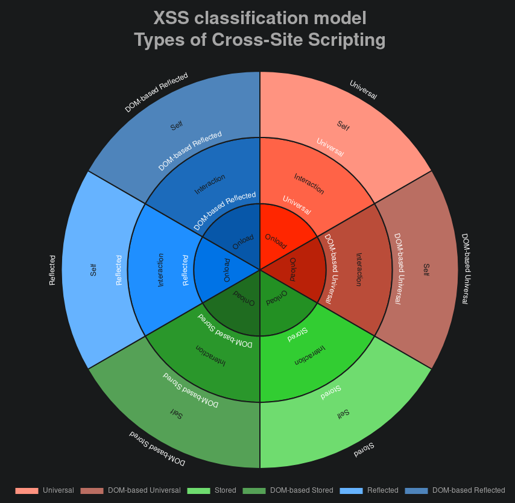

# XSS classification model

## Types of Cross-Site Scripting

[[Website]](https://noraj.github.io/XSS-classification-model/)

### References

- [OWASP - Types of Cross-Site Scripting](https://www.owasp.org/index.php/Types_of_Cross-Site_Scripting)
- [Wikipedia - Cross-site scripting](https://en.wikipedia.org/wiki/Cross-site_scripting)
- [ASafety - [PoC-XSS] Leveraging Self-XSS via WYSINWYC](https://www.asafety.fr/en/vuln-exploit-poc/poc-xss-elever-et-exploiter-une-self-xss-via-wysinwyc/), especially this [picture](https://www.asafety.fr/wp-content/uploads/Self-XSS_Reflected_DOM-based-768x768.png)
- [Acunetix - Universal Cross-site Scripting (UXSS): The Making of a Vulnerability](https://www.acunetix.com/blog/articles/universal-cross-site-scripting-uxss/)

### Made with

- [Chart.js](https://www.chartjs.org/)
- [chartjs-plugin-labels](https://github.com/emn178/chartjs-plugin-labels)

### Display

The display is better on a high-resolution screens, and teh chart will
probably not render at all on most smartphones.
